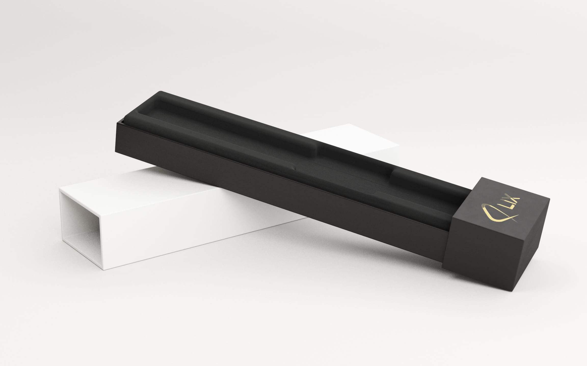
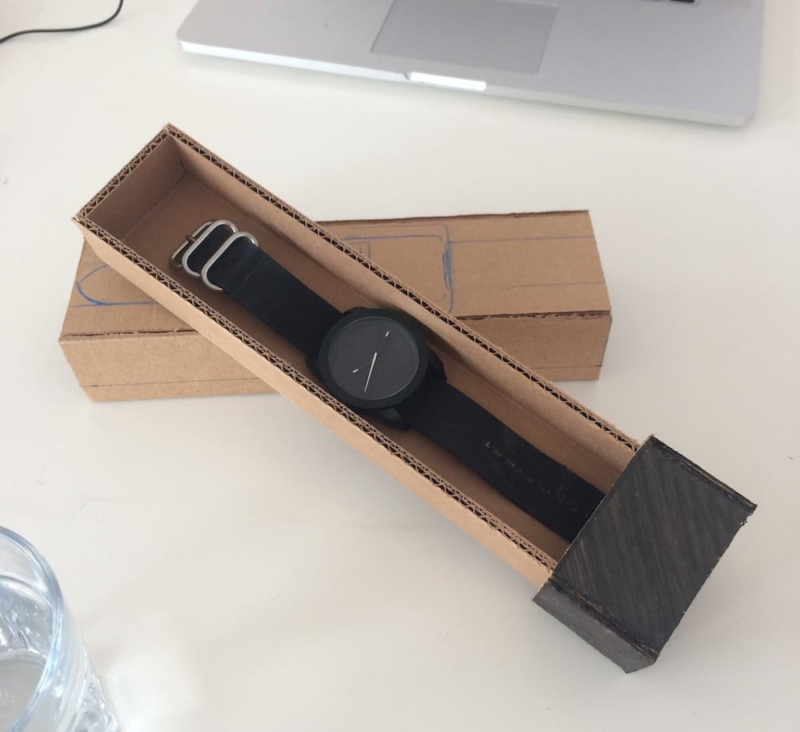
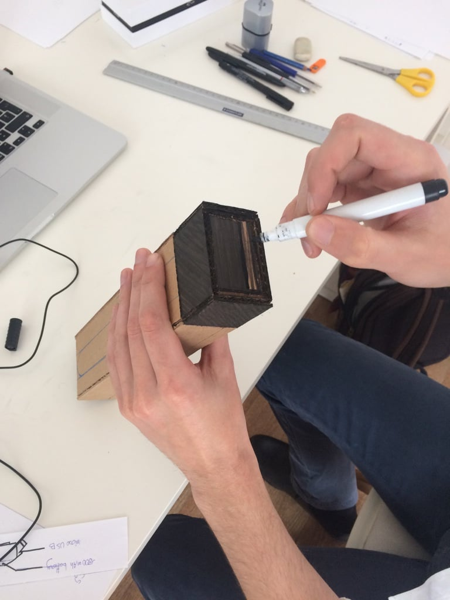
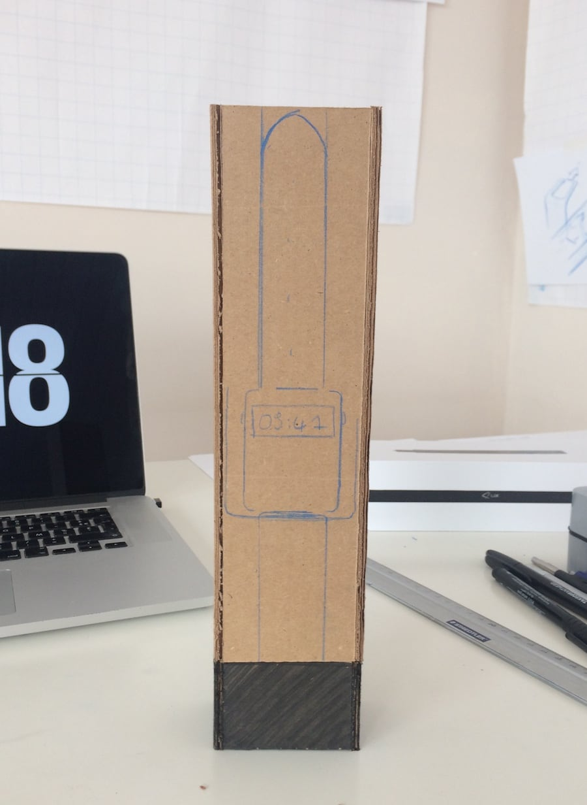

# %meta.title%

Near the end of my internship at [Lixpen], I had the chance to design **a packaging concept** for the upcoming [Watt], a watch and external battery for the [Lix].

[Lixpen]: http://www.lixpen.com
[Lix]: https://eu.lixpen.com/pages/lix-pen-v1
[Watt]: https://eu.lixpen.com/pages/lix-wat-t

